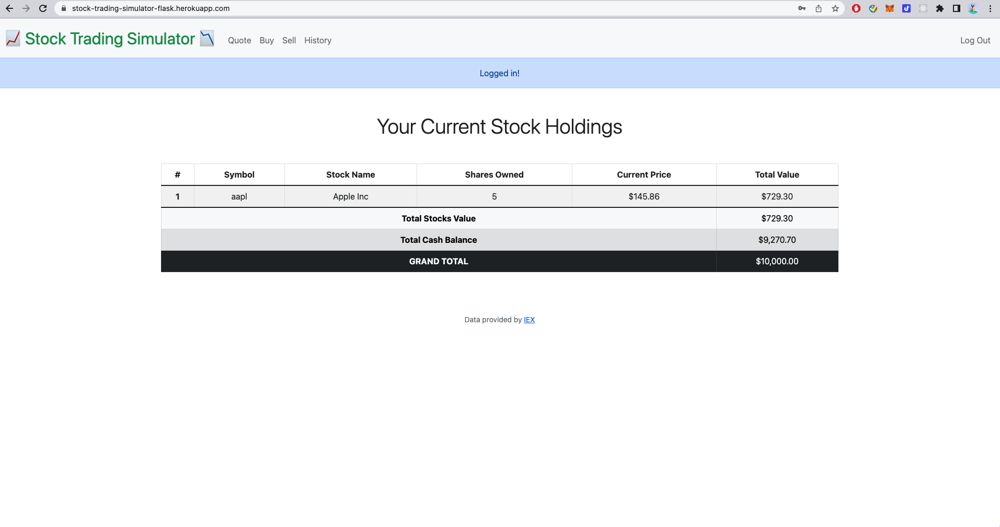
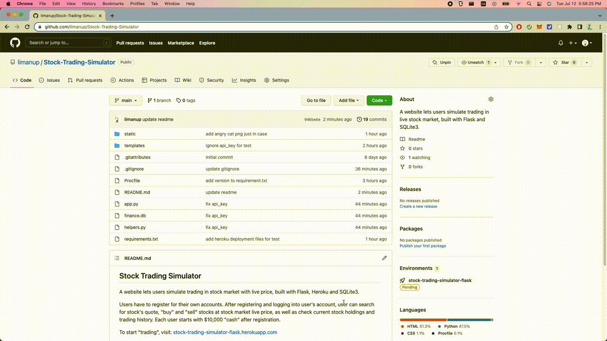
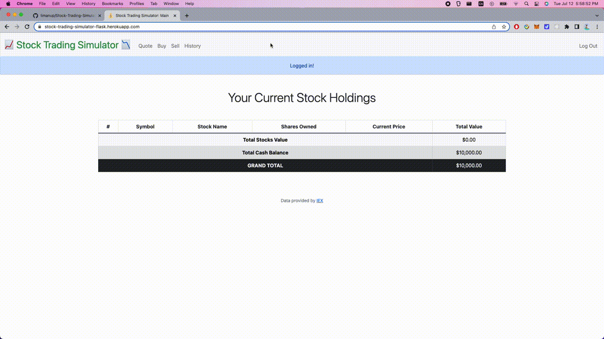
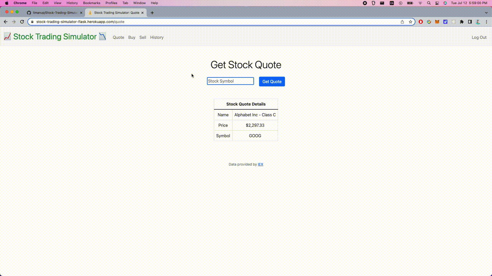
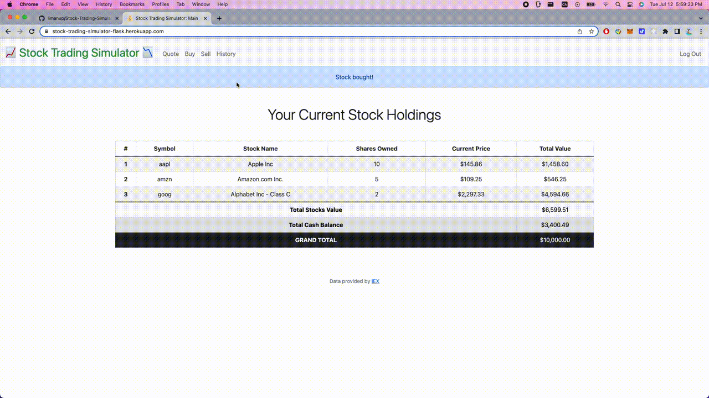
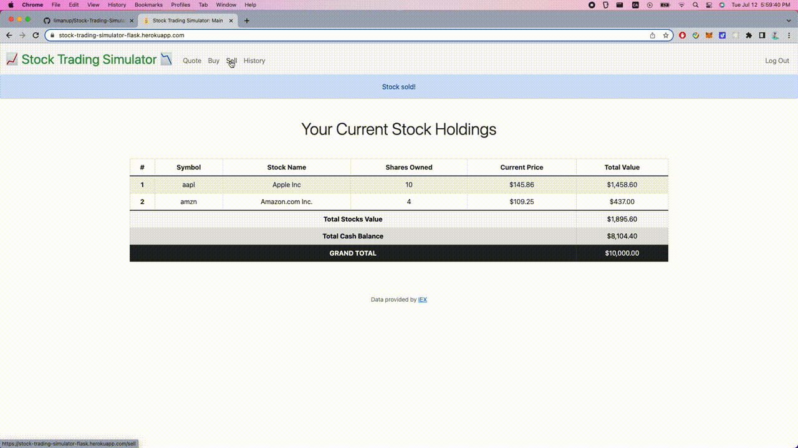

## Stock Trading Simulator

A website lets registered users simulate trading in stock market with live price, built with Flask and SQLite3, hosted on Heroku.

Users have to register for their own accounts. After registering and logging into user's account, user can search for stock's quote, "buy" and "sell" stocks at stock market live price, as well as check current stock holdings and trading history. Each user starts with $10,000 "cash" after registration.

To start "trading", visit: [stock-trading-simulator-flask.herokuapp.com](https://stock-trading-simulator-flask.herokuapp.com/)

### IEX

The stock market live price is queried from [IEX](https://exchange.iex.io/products/market-data-connectivity/).  
IEX lets you download stock quotes via their API (application programming interface) using URLs like `https://cloud-sse.iexapis.com/stable/stock/nflx/quote?token=API_KEY`.

## Illustrations

### Main Page When User Logs In

### Register and Login

### Get Stock Quote

### Buy Stock

### Sell Stock

### History and Logout

